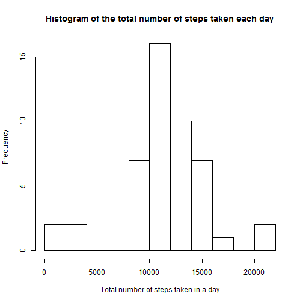
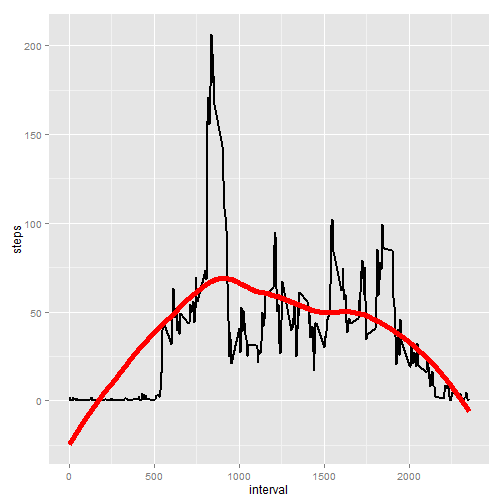
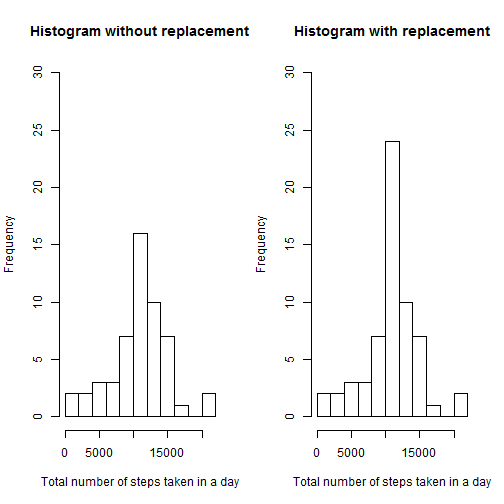

# Reproducible Research: Project Assignment 1

## Loading and preprocessing the data

Install and load required libraries:


```r
if (!('ggplot2' %in% .packages(all.available=TRUE))) {install.packages("ggplot2")}
if (!('lattice' %in% .packages(all.available=TRUE))) {install.packages("lattice")}
library(ggplot2)
library(lattice)
```

Load the data (i.e. read.csv())


```r
activity <- read.csv('data/activity.csv',header=TRUE,sep=',',na.strings = 'NA')
head(activity)
```

```
##   steps       date interval
## 1    NA 2012-10-01        0
## 2    NA 2012-10-01        5
## 3    NA 2012-10-01       10
## 4    NA 2012-10-01       15
## 5    NA 2012-10-01       20
## 6    NA 2012-10-01       25
```

## Analysis of number of steps per day

Aggregate number of steps for each day and calculate mean and median.


```r
activity_daily <- aggregate(steps ~ date, data = activity, sum, na.action= na.omit)
head(activity_daily)
```

```
##         date steps
## 1 2012-10-02   126
## 2 2012-10-03 11352
## 3 2012-10-04 12116
## 4 2012-10-05 13294
## 5 2012-10-06 15420
## 6 2012-10-07 11015
```

```r
mean(activity_daily$steps)
```

```
## [1] 10766.19
```

```r
median(activity_daily$steps)
```

```
## [1] 10765
```

The mean total number of steps taken per day is **10766.19** and the median total number of steps taken per day is **10765**.

The following figure shows a histogram of the total number of steps taken each day:

```r
hist(activity_daily$steps,breaks=seq(0,22000,by=2000),xlab="Total number of steps taken in a day",ylab="Frequency",main="Histogram of the total number of steps taken each day")
```

 

## Analysis of average number of steps at different times of day

What is the average daily activity pattern?

```r
activity_interval <- aggregate(steps ~ interval, data = activity, mean, na.action= na.omit)
head(activity_interval)
```

```
##   interval     steps
## 1        0 1.7169811
## 2        5 0.3396226
## 3       10 0.1320755
## 4       15 0.1509434
## 5       20 0.0754717
## 6       25 2.0943396
```

Time series plot of all 5-minutes intervals and the average number of steps taken averaged across all days:

```r
ggplot(activity_interval, aes(x=interval,y=steps)) + geom_line(lwd=1) + geom_smooth(method="loess",lwd=2,colour="red",se=FALSE)
```

 

> Which 5-minute interval, on average across all the days in the dataset, contains the maximum number of steps?


```r
activity_interval[activity_interval$steps==max(activity_interval$steps),"interval"]
```

```
## [1] 835
```

The 5-minute interval containing on average the maximum number of steps is the interval with the id **835**.

## Replacing missing values

> Calculate and report the total number of missing values in the dataset (i.e. the total number of rows with NAs)


```r
sum(is.na(activity$steps))
```

```
## [1] 2304
```

The total number of observations with missing values is **2304**.

> In the original dataset let us replace steps in observations where steps figure is NA by the mean for that specific 5-minute interval. Let us store this data set into activity_missings_replaced.


```r
activity_missings_replaced <- merge(activity, activity_interval, by.x = "interval", by.y = "interval")
activity_missings_replaced[is.na(activity_missings_replaced$steps.x),c("steps.x")]<-activity_missings_replaced[is.na(activity_missings_replaced$steps.x),c("steps.y")]
activity_missings_replaced<-activity_missings_replaced[,c("interval","steps.x","date")]
colnames(activity_missings_replaced)<-c("interval","steps","date")
```

Let us analyse the total number of steps for each day for the dataset with replaced NA values


```r
activity_daily_replaced <- aggregate(steps ~ date, data = activity_missings_replaced, sum)
head(activity_daily_replaced)
```

```
##         date    steps
## 1 2012-10-01 10766.19
## 2 2012-10-02   126.00
## 3 2012-10-03 11352.00
## 4 2012-10-04 12116.00
## 5 2012-10-05 13294.00
## 6 2012-10-06 15420.00
```

```r
mean(activity_daily_replaced$steps)
```

```
## [1] 10766.19
```

```r
median(activity_daily_replaced$steps)
```

```
## [1] 10766.19
```

In the dataset where NA values for steps have been replaced:
The mean total number of steps taken per day is **10766.19** and the median total number of steps taken per day is **10766.19**.

The following figure shows a histogram of the total number of steps taken each day in the dataset for the dataset with omitted NA values and for the dataset where NA values have been replaced:

```r
par(mfrow=c(1,2))
hist(activity_daily$steps,breaks=seq(0,22000,by=2000),xlab="Total number of steps taken in a day",ylab="Frequency",main="Histogram without replacement",ylim=c(0,30))
hist(activity_daily_replaced$steps,breaks=seq(0,22000,by=2000),xlab="Total number of steps taken in a day",ylab="Frequency",main="Histogram with replacement",ylim=c(0,30))
```

 

> What is the impact of imputing missing data on the estimates of the total daily number of steps?

Replacing missing values for steps lets us consider also 8 dates when no measurements were made (e.g. 2012-11-30). As we are replacing steps for each interval with the average number of steps for that interval, this has no impact on the calulcation of the average total daily number of steps, for the calculation of the total number of steps taken across the whole period, this makes sense, as otherwise our estimate would be too low. However, it would be best to investigate on why there were no measurements made on these days.

## Are there differences in activity patterns between weekdays and weekends?

Let us introduce a new dataset activity_weekdays containing a day variable with the value 'weekday' or 'weekend' depending on the date. 


```r
activity_weekdays <- cbind(activity_missings_replaced,ifelse(weekdays(as.Date(activity_missings_replaced$date)) %in% c('Sunday','Saturday'),'weekend','weekday'))
colnames(activity_weekdays) <- c('interval','steps','date','day')
activity_days <- aggregate(steps ~ day + interval, data = activity_weekdays, mean, na.action= na.omit)
head(activity_days)
```

```
##       day interval      steps
## 1 weekday        0 2.25115304
## 2 weekend        0 0.21462264
## 3 weekday        5 0.44528302
## 4 weekend        5 0.04245283
## 5 weekday       10 0.17316562
## 6 weekend       10 0.01650943
```

Let us compare average number of steps taken for all 5-minutes interval averaged across all weekday days and all weekend days.


```r
xyplot(steps ~ interval | day, layout=c(1,2), data = activity_days, type = 'l',ylab="Number of steps",xlab="Interval")
```

 

